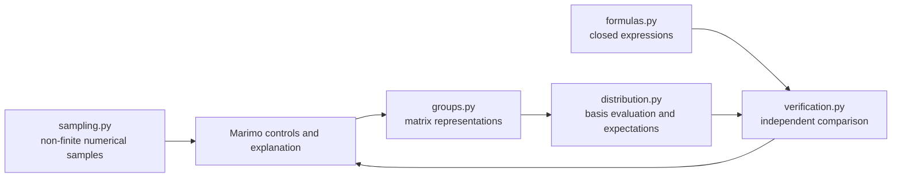

# Architecture

The project separates mathematical objects, numerical evaluation, proposed
formulas, verification, and presentation.  A Marimo notebook should orchestrate
these layers, not reimplement them.



## Layers

- `core.py` owns partitions, partition generation, and `z_lambda`.
- `groups.py` owns finite matrix representations.  It retains one matrix per
  abstract group element, even when a representation has a kernel, so group
  averaging remains correct.
- `distribution.py` evaluates symmetric-function observables from matrices.
  Functions described as moments or expectations always use the uniform
  probability measure on the finite group.
- `formulas.py` contains expressions being tested.  These implementations must
  not call the corresponding explicit evaluator.
- `verification.py` compares the two paths over partitions and produces a
  `VerificationReport`.
- `notebook_support.py` only formats values for display.
- `sampling.py` is separate because random unitary and symplectic samples are
  not enumerated finite groups.
- Marimo files provide controls, mathematical narration, and tables.

## Project environment

Each notebook carries PEP 723 metadata declaring Marimo and this repository's
package as an editable relative-path dependency. `uvx marimo ... --sandbox`
therefore creates an isolated notebook environment without modifying
`sys.path` or globally installing the library. For repeated development,
`uv sync` additionally creates the shared `.venv` project environment. Marimo
and pytest are development dependencies; NumPy remains the library's runtime
dependency.

## Normalization convention

All public moment and expectation functions use the uniform average

```text
(1 / |G|) sum over g in G.
```

An unnormalized group sum may be useful as an intermediate character sum or as
the numerator of a Reynolds operator, but it is not exposed as an expectation.
The cyclic monomial walkthrough intentionally retains an incorrect candidate
with coefficient `n` and verifies that normalized enumeration rejects it.

## Adding a result

1. Add or reuse a representation constructor in `groups.py`.
2. Add an explicit evaluator to `distribution.py` only if the required basis or
   observable is new.
3. Put the closed expression in `formulas.py`.
4. Add numerical tests comparing the independent implementations.
5. Build a thin Marimo walkthrough that calls the public APIs.

For the theorem

```text
C_n -> GL_1(C),  j -> exp(2 pi i j / n),
```

the corresponding implementation is:

- representation: `cyclic_character`;
- explicit monomial coefficient: `scalar_sigma_monomial_coefficient`;
- theorem: `cyclic_sigma_monomial_coefficient`;
- walkthrough: `marimo_notebooks/cyclic_monomial_walkthrough.py`.
